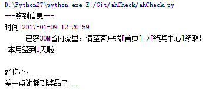
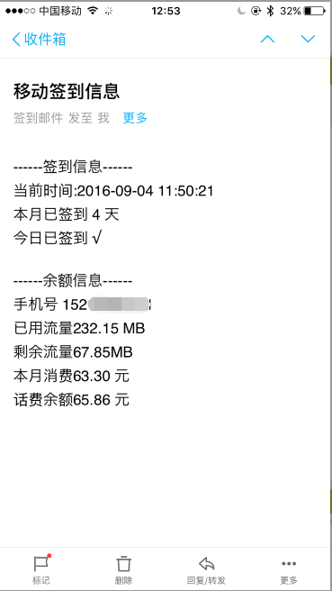

#安徽移动APP每日签到脚本

## 1. 相关内容
- `ahCheck.py` #主模块代码

这一行配置要签到的账号信息，发件邮箱和收件邮箱自行更改

```json
{
	"userIn.userPasswd": "azPGGyxxxxx",  				#加密后密码
	"userIn.phone_no": "152xxx7101",  					#手机号
	"token": "7215751b1ed2de841fd705456xxxx",  			#token
	"mail": ""  										#收件邮箱
}
```

- 每日自动签到和摇一摇

- APP签到一定天数及摇一摇可以获得流量红包


## 2.具体功能

###1. 每天自动签到和摇一摇



###2.每隔一定时间发送资费邮件




## 3.相关技术细节

- 没有技术含量……

##3. 备注
- 2017年1月9日测试可用

- 实现的是ios端APP的协议

- 最新APP版本更新了滑动验证，代码未实现

- token和加密后密码需抓包获取，代码未实现

##4. 更新
- 暂无

